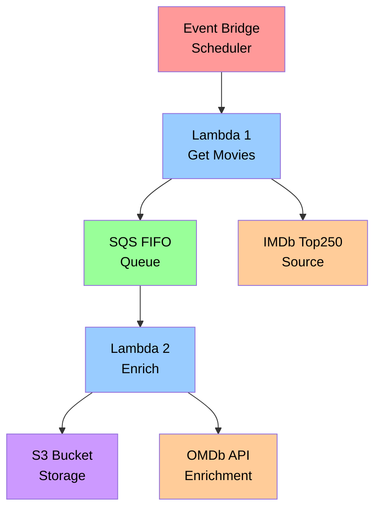

# Top 10 Movies - AWS Pipeline

A serverless AWS pipeline that fetches the top 10 movies from IMDb's Top 250 list, enriches them with additional data from OMDb API, and stores the results in S3.

## Architecture

This project implements a decoupled, event-driven architecture using AWS services:



## Features

- **Serverless Architecture**: Built entirely on AWS Lambda functions
- **Event-Driven Processing**: Uses SQS FIFO queue for reliable message processing
- **Data Enrichment**: Enhances basic movie data with detailed information from OMDb API
- **Secure Storage**: Encrypted S3 bucket with proper access controls
- **Type Safety**: Full TypeScript-style type hints for Python code
- **Error Handling**: Comprehensive logging and error handling throughout the pipeline
- **Infrastructure as Code**: Complete CloudFormation template for easy deployment

## AWS Services Used

- **AWS Lambda**: Two functions for data fetching and enrichment
- **Amazon SQS**: FIFO queue for reliable message processing between functions
- **Amazon S3**: Encrypted storage for enriched movie data
- **AWS CloudFormation**: Infrastructure as Code deployment
- **Amazon CloudWatch**: Logging and monitoring
- **AWS SAM**: Serverless Application Model for Lambda deployment

## Data Flow

1. **Trigger**: EventBridge scheduler (or manual invocation) triggers the first Lambda
2. **Fetch**: `get_top10_movies` Lambda fetches IMDb Top 250 from S3 source
3. **Queue**: Top 10 movies are sent to SQS FIFO queue with deduplication
4. **Process**: `enrich_top10_movies` Lambda is triggered by SQS messages
5. **Enrich**: Each movie is enriched with detailed data from OMDb API
6. **Store**: Final enriched data is stored in encrypted S3 bucket

## Deployment

### Prerequisites
- AWS CLI configured with appropriate permissions
- AWS SAM CLI installed
- OMDb API key (get one from [OMDb API](http://www.omdbapi.com/))

## Development

### Local Testing
```bash
# Install dependencies
pip install -r src/lambda/requirements.txt

# Set environment variables
OMDB_API_KEY=your_api_key

# Test functions locally (requires AWS credentials)
python src/lambda/get_top10_movies.py
```

### Type Checking
The project uses comprehensive type hints compatible with Python 3.13+:
```bash
pip install mypy boto3-stubs
mypy src/lambda/
```

## API Dependencies

- **OMDb API**: `https://www.omdbapi.com/` (requires API key)

## License

This project is licensed under the GNU General Public License v3.0 - see the [LICENSE](LICENSE) file for details.
